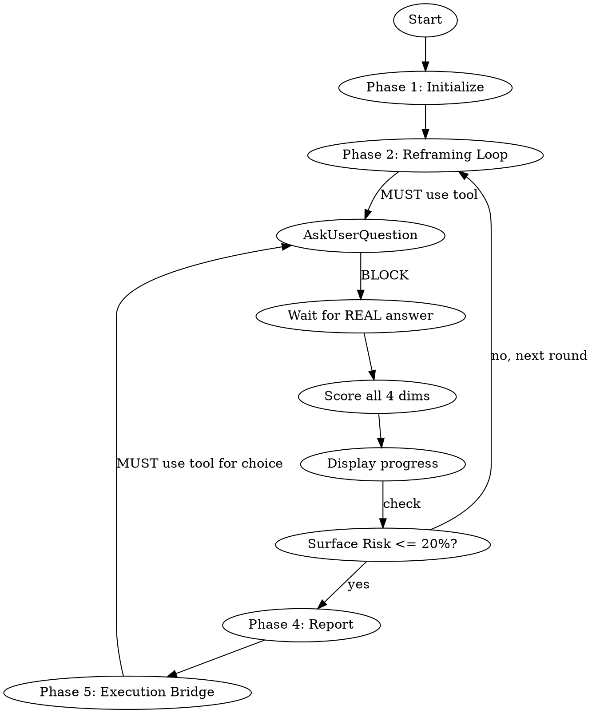

# Context Reframing

Surface-level requests lead to surface-level solutions. This skill systematically excavates the real problem before you commit to solving the wrong one.

```
NO SOLUTIONS WITHOUT CONTEXT DEPTH FIRST
```

<EXTREMELY-IMPORTANT>
This skill is an INTERACTIVE conversation with the user. You MUST use the AskUserQuestion tool
to ask questions and WAIT for real answers. This is not negotiable. This is not optional.
You cannot rationalize your way out of this.

IF YOU OUTPUT A QUESTION AS PLAIN TEXT INSTEAD OF USING AskUserQuestion, YOU HAVE FAILED.
IF YOU SIMULATE, FABRICATE, OR ASSUME USER ANSWERS, YOU HAVE FAILED.
</EXTREMELY-IMPORTANT>

<HARD-GATE>
Do NOT propose solutions until Surface Risk drops below 20%. Solving the wrong problem well is worse than not solving it at all.
</HARD-GATE>

<HARD-GATE>
NEVER simulate, fabricate, or assume user answers. Each question in the reframing loop
MUST be delivered to the actual user via the AskUserQuestion tool and you MUST WAIT for
their real response before scoring or proceeding to the next round. Violating this is
violating the SPIRIT of reframing — you cannot reframe without the user's actual voice.
</HARD-GATE>

## Red Flags — If You Think Any of These, STOP

| Your Thought | Reality |
|-------------|---------|
| "I'll just ask in plain text" | NO. Use AskUserQuestion tool. Plain text questions don't block execution. |
| "I can simulate likely answers" | NO. The whole point is discovering what you DON'T expect. |
| "I already know the context" | NO. Your assumption IS the problem this skill solves. |
| "Let me explore the code first, then decide" | Explore first is fine, but questions MUST still use AskUserQuestion. |
| "The user seems busy, I'll skip questions" | NO. Fast wrong > slow right is a myth. Use the tool. |
| "One plain text question is fine" | NO. EVERY question uses AskUserQuestion. No exceptions. |
| "I'll batch multiple questions" | NO. One question at a time via AskUserQuestion. |
| "The answer is obvious from context" | If it were obvious, the user wouldn't need reframing. Ask. |

## The Core Insight

| Level | Name | What It Is | Elevator Example | Filter Example |
|-------|------|-----------|-----------------|---------------|
| L1 | **Voice** | What they said | "엘리베이터가 느려요" | "필터를 더 늘려주세요" |
| L2 | **Need** | Immediate goal | "빨리 이동하고 싶다" | "상품을 빨리 찾고 싶다" |
| L3 | **Context** | Real situation | "기다림이 지루하다" | "탐색하며 헤매는 중" |

**Voice-level solution** (고객 집중): Faster motor / 50 more filters
**Context-level solution** (고객 중심): Install a mirror / Better curation

## When to Use

- Feature requests or user feedback that might be surface-level
- Bug reports where the symptom might mask a deeper design flaw
- Vague requirements before committing to an approach
- Any time "solving the stated problem" feels suspiciously easy
- When someone quotes user feedback: "유저가 ~라고 했는데"

## When NOT to Use

- The request is concrete and specific (file paths, function names, acceptance criteria)
- You already understand the full context
- The user says "just do it" or "skip the questions"
- Simple, mechanical tasks (formatting, renaming, standard CRUD)

## Execution Flow



### Phase 1: Initialize

1. **Detect project type**: brownfield (existing code) or greenfield
2. **For brownfield**: Spawn `explore` agent to map relevant code areas before asking the user anything
3. **Initialize state** at `.omc/state/reframing-state.json`
4. **Announce** (output as plain text — this is the ONLY plain text output before questions begin):

> Starting context reframing. I'll ask targeted questions to find the real problem behind this request. After each answer, I'll show your Context Depth Score.
>
> **Your request:** "{voice}"
> **Project type:** {greenfield|brownfield}
> **Current Surface Risk:** 100%

### Phase 2: Reframing Loop

Repeat until Surface Risk <= 0.2 OR early exit OR hard cap (15 rounds):

**Step A — Target the weakest dimension**

Identify which of the 4 scoring dimensions has the lowest score. Generate ONE question that specifically improves that dimension. Questions should expose ASSUMPTIONS, not gather feature lists.

See [references/question-patterns.md](references/question-patterns.md) for templates by phase and dimension.

**Step B — Ask the question using AskUserQuestion**

You MUST invoke the `AskUserQuestion` tool with the question. Format:

```
AskUserQuestion(question="Round {n} | Targeting: {weakest_dimension} | Surface Risk: {score}%\n\n{question}")
```

Do NOT proceed to Step C until the user has responded. Do NOT output the question as plain text. Do NOT guess what the user might say.

**Step C — Score all 4 dimensions**

ONLY after receiving the REAL answer from the user, re-score ALL dimensions from scratch using the full conversation so far. Scores CAN decrease if contradictions emerge.

See [references/scoring-engine.md](references/scoring-engine.md) for the 5-point rubric and calculation logic.

**Step D — Display progress** (as plain text output)

```
Round {n} complete.

| Dimension        | Score | Weight | Weighted | Gap              |
|------------------|-------|--------|----------|------------------|
| Voice Fidelity   | {s}   | {w}%   | {s*w}    | {gap or "Clear"} |
| Need ID          | {s}   | {w}%   | {s*w}    | {gap or "Clear"} |
| Context Disc.    | {s}   | {w}%   | {s*w}    | {gap or "Clear"} |
| Reframe Valid.   | {s}   | {w}%   | {s*w}    | {gap or "Clear"} |
| **Surface Risk** |       |        | **{r}%** |                  |

{r <= 20 ? "Threshold met. Ready to report." : "Next question targets: {weakest}"}
```

**Step E — Check limits**

- **Round 3+**: If user says "enough" / "let's go" / "그만", use AskUserQuestion to confirm early exit with Surface Risk warning
- **Round 10**: Use AskUserQuestion: "10 rounds reached. Surface Risk: {r}%. Continue or proceed with current clarity?"
- **Round 15**: Hard cap — proceed with current clarity

### Phase 3: Challenge Modes

At specific round thresholds, shift questioning perspective. Each mode activates ONCE, then returns to normal questioning. Track used modes in state.

| Mode | Round | Inspiration | Core Question |
|------|-------|-------------|---------------|
| **Mirror** (거울) | 3+ | Elevator mirror | "인지된 문제가 진짜 문제인가? 이 요청 뒤의 감정은?" |
| **Levitt** (레빗) | 5+ | Drill->Hole->Picture | "한 단계 더: Need 뒤의 Context는?" |
| **Inversion** (반전) | 7+ | Adhesive hook | "이 필요 자체를 없앨 수는 없을까?" |

See [references/challenge-modes.md](references/challenge-modes.md) for prompt templates and activation rules.

**Stall detection**: If Surface Risk doesn't change by more than +/-0.05 for 3 consecutive rounds, activate the next unused challenge mode.

**Challenge mode questions MUST also use AskUserQuestion.** No exceptions.

### Phase 4: Generate Report

Output the report as plain text:

```
CONTEXT REFRAMING REPORT
=======================================
Surface Risk: {r}% (threshold: <=20%)

+-- VOICE ------------------------------+
| "{exact user words}"                   |
+-- NEED --------------------------------+
| {identified immediate goal}            |
+-- CONTEXT -----------------------------+
| {discovered real situation}            |
+----------------------------------------+

SOLUTIONS BY LEVEL
--------------------------------------
Voice Solution:   {literal solution}
Need Solution:    {goal-addressing solution}
Context Solution: {situation-addressing solution}  <- Recommended

CONTEXT DEPTH SCORE
+------------------+-------+--------+----------+
| Dimension        | Score | Weight | Weighted |
+------------------+-------+--------+----------+
| Voice Fidelity   | {s}   |  {w}%  |  {s*w}   |
| Need ID          | {s}   |  {w}%  |  {s*w}   |
| Context Disc.    | {s}   |  {w}%  |  {s*w}   |
| Reframe Valid.   | {s}   |  {w}%  |  {s*w}   |
+------------------+-------+--------+----------+
| SURFACE RISK     |       |        |  {r}%    |
+------------------+-------+--------+----------+

ASSUMPTIONS EXPOSED
+----------------------------+-------------------------+
| {what was assumed}         | -> {what was discovered} |
+----------------------------+-------------------------+
```

Save report to `.omc/reframes/general-{slug}.md`.

### Phase 5: Execution Bridge

After displaying the report, you MUST use AskUserQuestion to present the next step choices:

```
AskUserQuestion(question="Reframing complete (Surface Risk: {r}%)\n\nNext step:\n  [1] Deep Interview - Define spec from this problem\n  [2] Brainstorming - Jump to solution design\n  [3] Export - Save report and exit\n  [4] Dig Deeper - Continue exploring Context\n\nWhich would you like?")
```

Do NOT choose for the user. Do NOT proceed without their selection.

## Context Depth Score (CDS)

```
Surface Risk = 1 - (voice * w_v + need * w_n + context * w_c + reframe * w_r)
```

**Gate:** Surface Risk <= 0.2 -> ready to proceed.

**Universal weights**: Voice 20% / Need 25% / Context 35% / Reframe 20%

Domain skills override these weights. See [references/scoring-engine.md](references/scoring-engine.md) for full rubrics and domain weight profiles.

## Common Rules

| Rule | Detail |
|------|--------|
| AskUserQuestion for ALL questions | NEVER ask questions as plain text output. ALWAYS use the AskUserQuestion tool. |
| One question at a time | Never batch multiple questions in a single AskUserQuestion call |
| WAIT for real answers | NEVER proceed without the user's actual response |
| Score every round | Display CDS transparently after each answer |
| Gather facts first | Explore codebase BEFORE asking user about it |
| Early exit | Round 3+, with Surface Risk warning via AskUserQuestion |
| Hard cap | 15 rounds max |
| State persistence | `.omc/state/reframing-state.json` for resume |
| Challenge modes | Mirror (R3+), Levitt (R5+), Inversion (R7+) -- each once |

## State Management

### On Session Start (Resume)

If `.omc/state/reframing-state.json` exists and contains an active session:
1. READ the state file
2. Announce: "Resuming reframing session from Round {n}. Surface Risk: {r}%"
3. Continue from the saved round

### On Each Round

Update state with current round, scores, challenge modes used, and conversation history summary.

## Edge Cases

**Voice Confirmed** -- When Voice IS the real problem:
Report shows `Result: VOICE CONFIRMED`. Reframe Validity scores 1.0 when Voice is validated as correct. The reframe confirms the original framing.

**Inconclusive Exit** -- Hard cap reached with Surface Risk > 0.2:
Report shows `Result: INCONCLUSIVE`. Lists ranked hypotheses with confidence levels. Use AskUserQuestion to present data-gathering options.

**Domain Overlap** -- Request matches multiple domains:
Use AskUserQuestion: "이 문제를 코드 수준에서 고치려는 건가요, 아니면 유저 경험 차원에서 분석하려는 건가요?"
Default to this universal skill if still ambiguous, then route to domain skill after Phase 1.

See [references/examples.md](references/examples.md) for worked examples of each path.

## Domain Skills

For domain-specific reframing with tailored weights, questions, and report formats:

- **Product**: `/product-reframing` -- Feature requests, user feedback (Context 40%)
- **Debug**: `/debug-reframing` -- Bugs, errors, stack traces (Reframe 30%)
- **Prompt**: `/prompt-reframing` -- AI conversation, ambiguous requests (balanced 25%)

## Pipeline Position

```
context-reframing -> deep-interview -> brainstorming -> execution
  "Real problem"     "Specification"   "Design"        "Build"
```

This skill handles problem DEFINITION, not solution SPECIFICATION. Keep it fast (5-10 min typical).

## Design Principles

1. **Voice is not the enemy** -- Capturing Voice accurately is the FIRST step. We don't dismiss what was said; we go deeper.
2. **Context is not always deeper** -- Sometimes Voice IS the real problem. The skill validates this too.
3. **Empathy over analysis** -- The elevator mirror worked because it addressed an EMOTION (boredom), not a metric (speed).
4. **Lighter than a spec** -- This is problem definition, not solution specification.
5. **The reframe must be testable** -- "Is this reframe more useful than the original request?" is always the final validation.
6. **Real answers only** -- Violating the letter of this process (skipping AskUserQuestion) IS violating the spirit of reframing.
